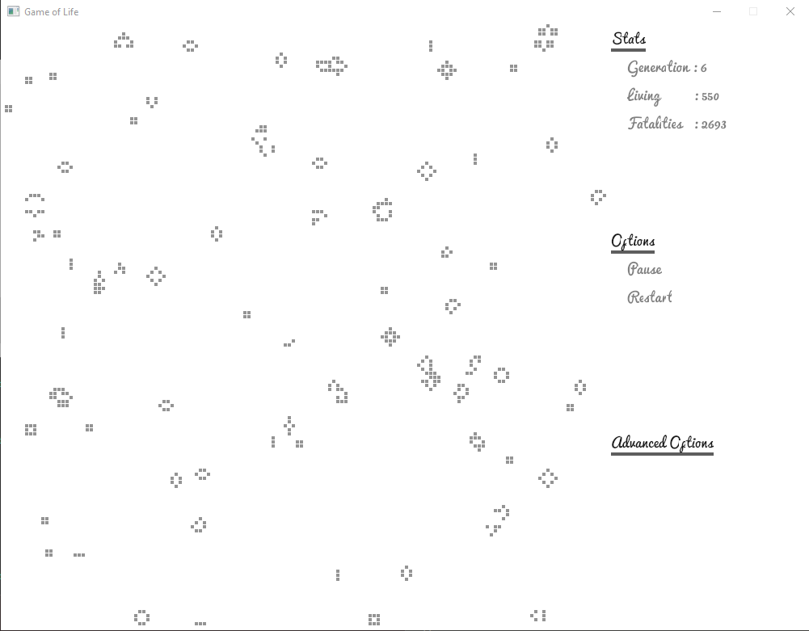

# Project Introduction
This repository contains my final project for CS 410: Rust Programming at Portland State University. The project is an implementation of [Conway's Game of Life](https://en.wikipedia.org/wiki/Conway%27s_Game_of_Life) using [Rust](https://www.rust-lang.org/en-US/) and the [ggez](https://github.com/ggez/ggez) 2D graphics framework. 

## Note on Compatibility
This program was written and compiled in Windows using rustc 1.28.0-nightly (e3bf634e0 2018-06-28). Compiling the same code on other versions of the rust compiler may produce errors. Example: rustc 1.25.0 throws "non-reference patter used to match reference" errors from code in gol.rs on lines 79, 192, and 193 which can be solved by updating the following lines of gol.rs:
* Line 79: dereference cell - `*cell`
* Line 192: dereference life - `*life`
* Line 193: Reference cell - `Some(ref cell)`

## Design Considerations
I wanted to keep this project simple so I could focus on learning Rust. My initial plan was to implement a very simple algorithm, the Game of Life, for various graphics frameworks, to include some web framework, so I could get an idea of which I would prefer using in future projects. Unfortunately, Rust is such a new language it makes it hard to find Crates that are not full of deprecated Rust code. Because of that I decided to stick with just one graphics framework and push it as far as I could in the time I had to complete this project. Out of that, I recognized that ggez does not have User Interface functionality built in and had to start thinking of ways to implement one myself. The UI in this project is not something to brag about, but it was a great starting point for working out ideas about how I could do it in the future. This project has inspired me to start working on a ggez User Interface Crate.

### Representing the map
I initially created the map as a 1D vector of Life structs where each contained all the data about their cell in the map and information about their neighbor cells. This became cumbersome when trying to find a specific cell and checking it for living neighbors. I decided to change it to a 2D vector which simplified finding a specific cell and continued to find that my approach was too redundant. I simplified it further by replacing the Life struct with an Option containing an x-y coordinate because all I really needed to know was if a cell was alive or dead (`Some(_) = alive, None = dead`). I still found this redundant because an index of the 2D vector doesn't need coordinate information, the index itself acts as a coordinate. As of Stage-2, I have not simplified that but plan to have it change to a 2D vector of bool values. 

### Optimization
It became clear that having more than 2k living cells reduced the performance of the application beyond an acceptable level. Ideal performance only happens around 500 living cells. I am still uncertain if this is because of copying the map each cycle, because of the structure of the map and how I check for neighbors, or if it is just cumbersome for ggez to draw each living cell beyond a certain number. My plan of action to improve optimization is to firstly continue simplifying the map and secondly introducing multithreading. 

### User Interface
I come from a web development background and decided to approach the problem of UI as if I were dealing with HTML/CSS (although it may not show). I thought of each element in the window like a Div in HTML. A Div can contain any number of additional elements, to include other Divs, or end at some base structure like a string (Like an AST). I implemented a UI element that acts like a div and contains limited styling meta-data (position, width, etc), a header, and a vector of generic types. So far, the only type I implemented is of a basic type that ends in a string. I think if I had more time I could flesh this concept out to include an exhaustive styling component based on the ggez interface (text-color, font, etc.) and a more complete set of implementations for types of contents that work with the UI element.

### Functionality
The Game of Life can be as complex as you want it to be and there are a lot of interesting structures that emerge even from the basic rule set. The end game of this project was not to just have a Game of Life program, but one that you could tweak to experiment with alternate rules and evaluate complex structures. This functionality is dependent on a UI that supports displaying options and allowing the user to select structures to add to the map. As of writing this, I'm not there yet.

# Stages of Development
1. [x] [Stage 1](https://github.com/MatthewGreenlaw/GameOfLife/releases/tag/Benchmark-1): Basic implementation
   1. [x] Create basic game elements
      * [x] Cells
      * [x] Map
   2. [x] Setup ggez to work with game elements
      * [x] [EventHandler](https://docs.rs/ggez/0.3.1/ggez/event/trait.EventHandler.html)
      * [x] [ContextBuilder](https://docs.rs/ggez/0.4.1/ggez/struct.ContextBuilder.html)
      * [x] [run](https://docs.rs/ggez/0.3.1/ggez/event/fn.run.html)
   3. [x] Implement the classic Game of Life [rules](https://en.wikipedia.org/wiki/Conway%27s_Game_of_Life#Rules)


2. [x] [Stage 2](https://github.com/MatthewGreenlaw/GameOfLife/releases/tag/Stage-2): Add UI
   1. [x] Create basic UI elements
      * [x] Import and display ttf
      * [x] Game Map element
      * [x] Stats element
      * [x] Options element
      * [x] Advanced options element
      
   2. [x] UI and Mouse interaction
      * [x] User interaction
         * [x] Capture mouse clicks
         * [x] Identify which area was clicked
      * [x] Update stat area with game statistics
      * [x] Option menu
         * [x] Implement user interaction for menu
         * [x] Update options upon user interaction



2. [ ] Stage 3: Text input and Advanced settings
   1. [ ] Capture keyboard clicks     
   2. [ ] Advanced option menu
      * [ ] Implement user interaction and text input for advanced menu
      * [ ] Update options upon user interaction

# Installation Instructions

## Linux

### Clone this repository
  * Open Terminal and change directory to the folder you want to install the files
  * Run `git clone https://github.com/MatthewGreenlaw/GameOfLife.git && cd GameOfLife`

### Install [rust](https://www.rust-lang.org/en-US/install.html)

### Install [SDL2 libraries](https://github.com/Rust-SDL2/rust-sdl2#user-content-requirements)
  * Run `sudo apt-get install libsdl2-dev`
  * Add the following to Cargo.toml: 
  ```
  [dependencies.gl]
  git = "https://github.com/bjz/gl-rs"
  ```
  * [Additional updates](https://github.com/ggez/ggez/issues/194) to graphics drivers may be needed.

### Compile and run
  * Open Terminal and change directory to the GameOfLife folder
  * Run `cargo run`

## Windows 10 installation
### Install [git](https://git-scm.com/download/win)

### Clone this repository
  * Open MINGW terminal
    * In File Explorer, navigate to the folder you want to install the files
    * Right-click to open the context menu
    * Click on 'Git Bash Here' to open a MINGW terminal
  * Enter the following into the MINGW terminal: `git clone https://github.com/MatthewGreenlaw/GameOfLife.git && cd GameOfLife`

### Install [Rustup](https://win.rustup.rs/)

### Install Visual Studio build tools
  * [Download and install](https://visualstudio.microsoft.com/thank-you-downloading-visual-studio/?sku=BuildTools&rel=15#)
    * Make sure that `windows 10 SDK` is checked during installation settings

### [Install SDL2 libraries](https://github.com/Rust-SDL2/rust-sdl2#windows-with-build-script)
  * Download and unzip: `http://www.libsdl.org/release/SDL2-devel-2.0.8-VC.zip`
  * Move all .dll files:
    * From: `{path to unzipped folder}\SDL2-2.0.8\lib\x86`
    * To: `{path to rustup installation}\.multirust\toolchains\stable-x86_64-pc-windows-msvc\lib\rustlib\x86_64-pc-windows-msvc\lib`
    * To: `{path to VS installation}\Microsoft Visual Studio\2017\BuildTools\VC\Tools\MSVC\14.14.26428\lib\x64`

  * Move SDL2.dll 
    * From: `{path to unzipped folder}\SDL2-2.0.8\lib\x86`
    * To: project root next to Cargo.toml

### Compile and run
  * Open MINGW terminal
    * In File Explorer, navigate to the GameOfLife folder
    * Right-click to open the context menu
    * Click on 'Git Bash Here', which opens a MINGW terminal
  * Enter the following into the MINGW terminal: `cargo run`
